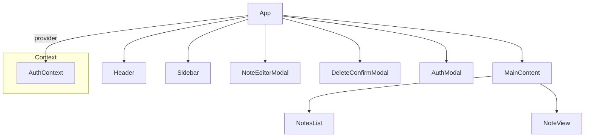
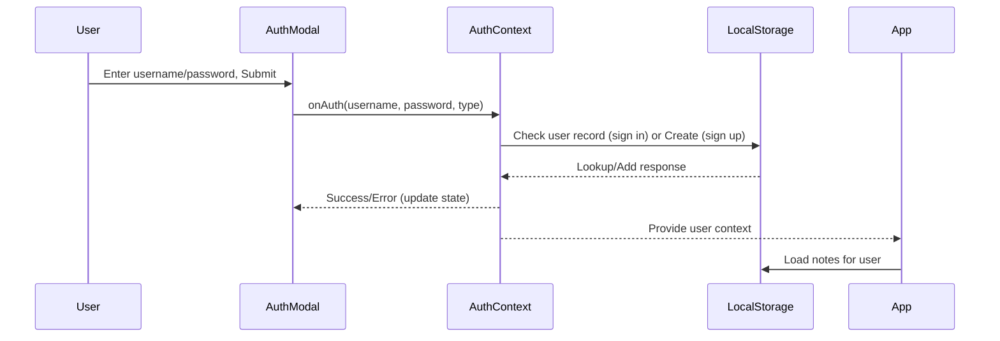

# Notes App Frontend: Comprehensive Documentation

## Table of Contents
1. Product Requirements (PRD)
2. Features & User Stories
3. Application Architecture
    - System Overview
    - Component Hierarchy (Mermaid)
    - Data Flow (Mermaid)
    - Authentication Flow (Mermaid)
4. State Management Approach
5. UI/UX Structure & Flows
6. Component Structure & Responsibilities
7. Styling, Theming, and Branding
8. Files, Utilities, and Notable Logic
9. Development, Build, and Tech Stack
10. Summary

---

## 1. Product Requirements (PRD)

### Overview
The Notes App enables users to securely create, organize, and manage personal notes through a modern, responsive web app. Key features include:

- Secure, local authentication (demo mode; no backend)
- CRUD operations for notes (Create, Read, Update, Delete)
- Organizing notes by category/tag
- Clean, intuitive UI with support for light/dark themes
- Responsive design for desktop and mobile devices
- All data and session persistence via browser localStorage

### Target Users
- Anyone wanting a lightweight, distraction-free note-taking tool.
- Users who need local-only, privacy-centric note management.
- Demo/test users for component-driven React UI patterns.

### Primary Use Cases
- Sign up or sign in to a private note collection
- Create, edit, and delete notes, assigning them to categories
- Quickly browse, select, and view notes per category
- Switch between visual themes
- Use on both desktop and mobile device browsers

---

## 2. Features & User Stories

### Core Features

- **User Authentication**
    - Modal-based signup and login
    - User session stored in localStorage
    - Error feedback for auth failures (duplicate/unknown user)

- **Notes Management**
    - Add/edit/delete notes with modal dialogs
    - Rich note meta: title, content, category, last-edited timestamp
    - Fast, in-place list updating via React state

- **Categorization**
    - Assign notes to categories/tags
    - Create new categories on the fly
    - Filter notes by category via sidebar

- **User Experience**
    - Responsive, modern interface
    - Light/dark theme toggle
    - Modals for all destructive or important flows
    - Empty/error states for onboarding and feedback

- **Persistence**
    - All data (auth, notes) kept within browser localStorage for privacy and instant loading

---

## 3. Application Architecture

### System Overview

This React frontend adopts a component-driven approach with top-level state lifting for orchestrating authentication, user data, note storage and UI presentation. Major architectural choices:

- All state and note data handled client-side (no backend calls)
- Core logic housed inside `App.js` and supported by global React context (`AuthContext`)
- Domain-specific utility modules for notes data persistence (`notesStorage.js`)
- Reusable, presentational UI components for all dialogs and the main layout

#### Top-level Mermaid Diagram: Full Component and Data Architecture

```mermaid
graph TD
    A[App.js (with AuthProvider)] --> B(Header)
    A --> C(Sidebar)
    A --> D(NotesList)
    A --> E(NoteView)
    A --> F(NoteEditorModal)
    A --> G(DeleteConfirmModal)
    A --> H(AuthModal)
    A -- uses --> I[AuthContext]
    A -- calls --> J[notesStorage.js]
    I -- provides --> A
    D -- on note select --> E
    D -- on create --> F
    E -- on edit/delete --> F
    E -- on delete --> G
    H -- updates --> I
    F -- on save --> A
    G -- on confirm/delete --> A
    subgraph LocalStorage
      J
    end
    A -- reads/writes --> J
```

---

### Component Hierarchy (Mermaid)


---

### Authentication Flow (Mermaid)


---

### Data Flow for Notes CRUD (Mermaid)
```mermaid
flowchart TD
    App -- open --> NoteEditorModal
    NoteEditorModal -- submit --> App
    App -- update --> notes state
    App -- save --> notesStorage.js
    notesStorage.js -- persist --> localStorage
    App -- update --> NotesList
    App -- update --> NoteView
    NoteView -- edit/delete --> App
    App -- open --> DeleteConfirmModal
    DeleteConfirmModal -- confirm --> App
```

---

## 4. State Management Approach

- **Authentication State:** managed by `AuthContext` (React Context + localStorage for session)
- **Notes State:** main array of notes stored in App state, updated on auth and on any CRUD operation, persisted using `notesStorage.js`
- **Categories:** derived from the notes array using Set logic—no separate store
- **Selections:**
    - `selectedCategory` (sidebar-driven)
    - `selectedNoteId` (note list-driven)
- **UI State (modals, theme):** maintained at the App.js level for predictable, one-directional state flow

All updates propagate to child components via props, ensuring clear data flow and encapsulation.

---

## 5. UI/UX Structure & Flows

### Layout

- **Header:** Branding and user actions (login/logout, user greeting)
- **Sidebar:** Lists all categories; supports switching and adding categories
- **MainContent:** Split into vertical panels: note list (left), note details (right)
- **Modals:** For editing/creating notes, authentication, and deletion confirmation
- **Theme Toggle:** Button for switching between light and dark modes

### UX Flows

**Sign Up / Sign In**
- User sees sign-in modal by default (unless session stored)
- On successful entry, modal closes, user's notes are loaded

**Note Creation & Editing**
- "New Note" button opens edit modal; on save, note is added and selected
- Edit button in detail view opens modal with prefilled form
- Validation ensures required input

**Note Deletion**
- Delete button in detail view opens confirmation modal, requiring explicit user action

**Category Management**
- Add category in sidebar (prompts via modal)
- Switch category by selecting from the sidebar; list and detail update instantly

**Theme Switching**
- Single click toggles between visually distinct light and dark modes

---

## 6. Component Structure & Responsibilities

- **App.js**
    - State orchestration, state lifting, all main handlers for CRUD, selections, authentication, theming
    - Layout composition (Header, Sidebar, content panels, modals)
- **Header**
    - Branding, user greeting, login/logout button
- **Sidebar**
    - List user categories, allow category selection and addition
- **NotesList**
    - Show notes for active category, selection logic, "add new" button
- **NoteView**
    - Read+write view for current note, edit and delete triggers
- **NoteEditorModal**
    - Modal for editing and creating notes, with validation and category select
- **DeleteConfirmModal**
    - Modal dialog ensuring extra confirmation before destructive note removal
- **AuthModal**
    - Modal for all authentication-related flows
- **context/AuthContext.js**
    - Full in-memory authentication demo logic: sign-up, sign-in, persistent session (no real password hashing)
- **utils/notesStorage.js**
    - All access to localStorage for reading/saving notes per user

---

## 7. Styling, Theming, and Branding

- **CSS Variables for Theming (App.css)**
    - Centralizes all layout colors as variables for easy theme switching; data-theme attribute switches context for light/dark palettes
- **Brand Colors**
    - Primary: `#1976d2`
    - Secondary: `#424242`
    - Accent: `#ff9800`
    - Danger: `#d32f2f` (for destructive actions)
- **Responsiveness**
    - Nested media queries in CSS for consistent UX on wide and narrow viewports
    - Mobile-friendly modals, sidebar, and panels

---

## 8. Files, Utilities, and Notable Logic

### Main files:
- `App.js` — Application shell, state store, orchestrates views and all CRUD/auth flows
- `src/components/*.js` — Presentational React components
- `src/context/AuthContext.js` — Singleton React context for managing demo "user" authentication
- `src/utils/notesStorage.js` — Utility for localStorage-based note array
- `src/App.css` — Core CSS, theming, and responsive breakpoints

### Notable Implementation Facts
- **All localStorage keys are prefixed (`notemaster-*`) to avoid clashes**
- **Note IDs** are generated as `${timestamp}+${random string}` for uniqueness
- **No external UI libraries** are used; styling is pure CSS-in-JS
- **All modals** are controlled via prop-based booleans, with their own input validation and error messages

---

## 9. Development, Build, and Tech Stack

- **Platform:** Modern React (hooks, functional components only)
- **No backend services:** All authentication and storage is front-end only
- **Build tool:** `react-scripts` / create-react-app foundation (with fast local dev & testing)
- **Linting:** ESlint config (`eslint.config.mjs`)
- **Testing:** Some core unit and integration tests exist (`App.test.js`, component tests)
- **Extensibility:** Designed to quickly be augmented with additional features or swapped for a real backend

---

## 10. Summary

This Notes App frontend exemplifies clean, maintainable, and thoroughly componentized React design covering all core note-taking flows, user account handling, UI theming, and responsive UX. With fully-local demo/persistent capabilities, it provides an extensible foundation well-suited both for personal use and for learning modern React design/browser persistence patterns.

---

**Authors:** Kavia CodeGen  
**Last Updated:** 2024  
